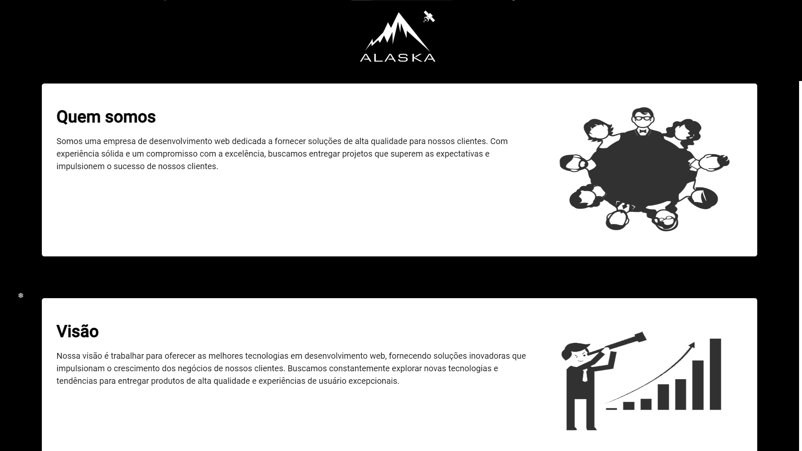
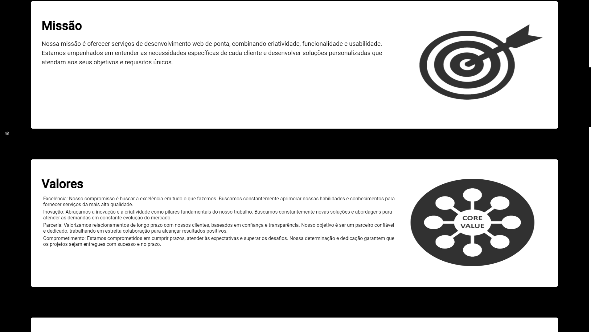
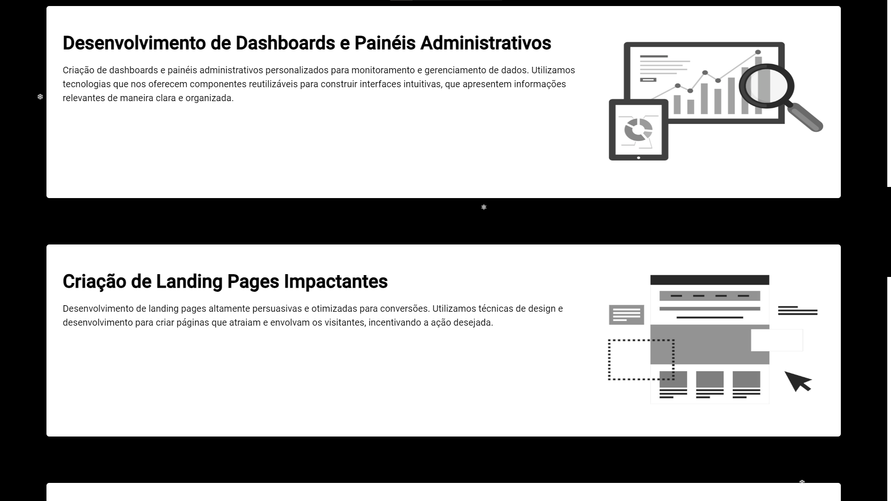
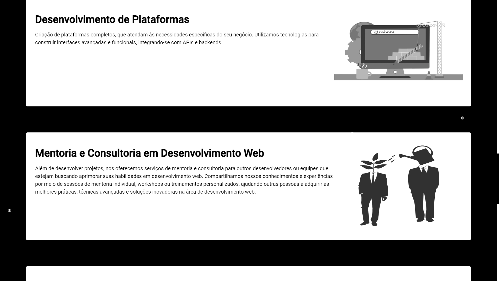
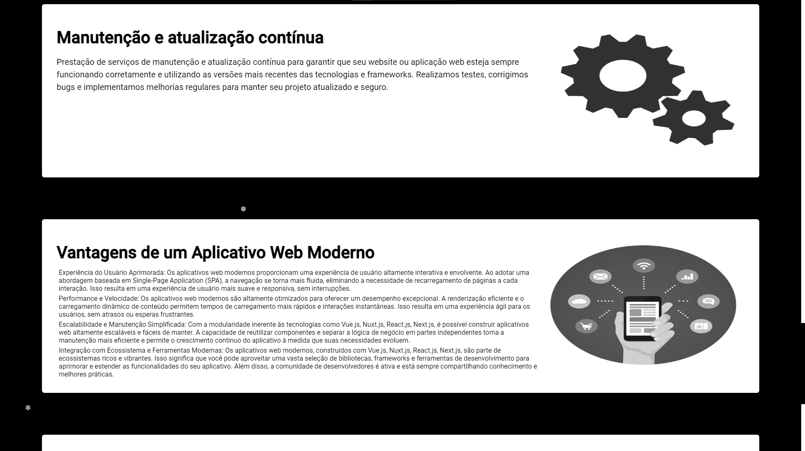
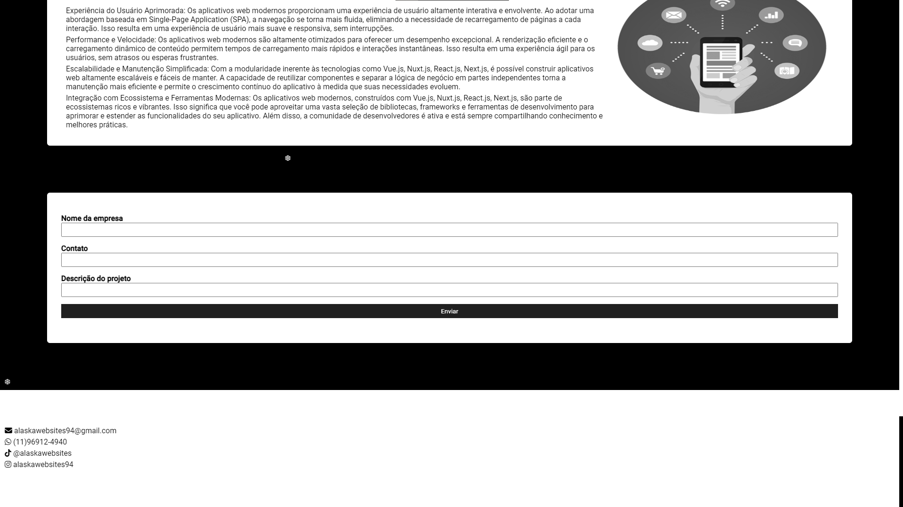

# Alaska Websites

Minha aplicação que é a apresentação e captação de clientes do meu microempreendimento.

# Recursos

- O aplicativo foi desenvolvido com CSS, HTML, SCSS, JavaScrip, TypeScript, Vue e Nuxt.

# Uso

1. Clone o repositório do GitHub.
2. Abra o projeto no seu editor de código.
3. Instale o pacote do projeto com npm install.
4. Starte o projeto com npm dev.

# Créditos

Este projeto foi criado por Alaska Websites.
